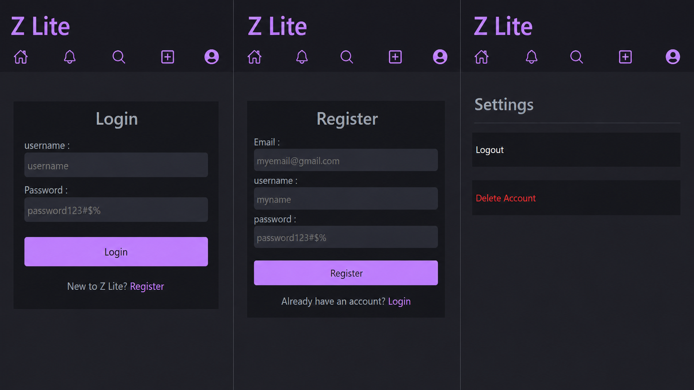
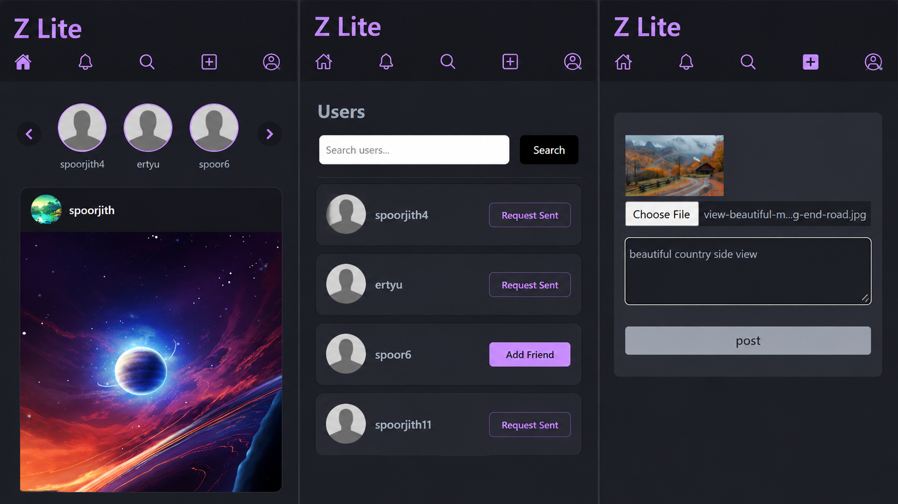
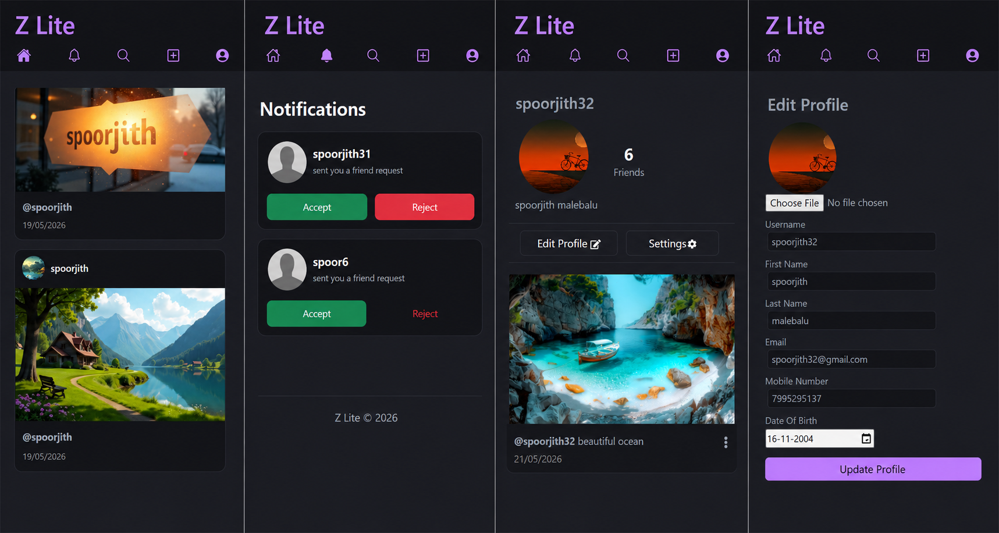

# Mini Instagram (Z-Lite)
Z-Lite is social media application inspired by instagram built using REST APIs with Django REST Framework.

The application allows logged in users,  
A user can post photos which will be shared across the site. users across the site can view the photos.  
search users by thier name and send friend requests to make friendships.

## Screenshots

## Features
- User registration
- Authenticated users only
- Sharing posts publicly
- Edit profile
- Send Friend Requests
- Make Friends
- Search users

## Tech used
### Backend
- Python
- Django REST Framework
- PostgreSQL

### Frontend
- React.js
- Axios
- CSS

### Tools
- Postman API Testing
- VS Code
- Git & GitHub actions
